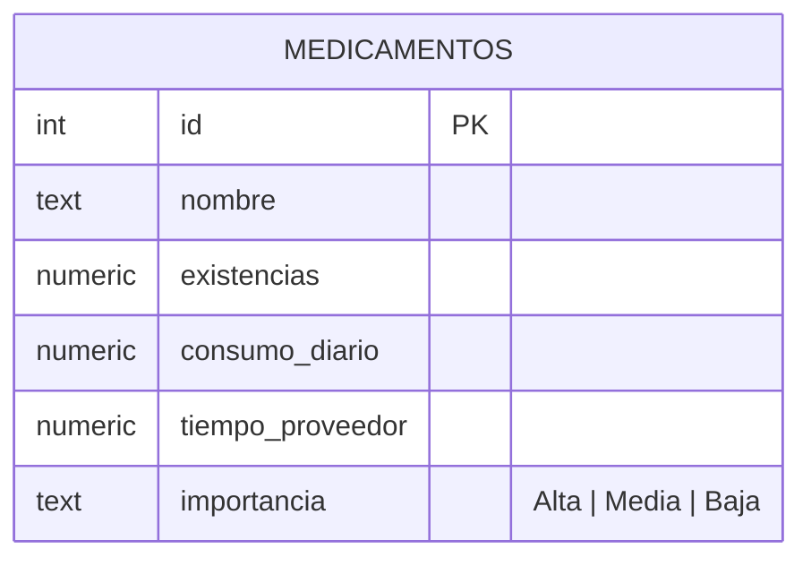

# Diagrama entidad-relación — Base de datos Supabase

## Alcance del modelo

Según lo definido en el [levantamiento de requerimientos](./requisitos.md), el MVP trabaja con **una sola sede** y **sin** entidades de proveedor, historial de movimientos ni usuarios. Esto se refleja en el modelo actual: una única tabla.

## Modelo actual



No existen relaciones porque no existen otras tablas: `medicamentos` es autocontenida. Los campos calculados (`dias_restantes`, `margen`, `score_urgencia`, `estado`) **no se persisten** — se calculan en el backend (`lib/priorizacion.ts`) en cada request y no viven en la base de datos.

## Diccionario de datos

| Campo | Tipo esperado | Nulo | Descripción |
|---|---|---|---|
| `id` | number | no | Identificador único, usado para ordenar la consulta base. |
| `nombre` | text | sí (no usado en el cálculo) | Nombre del medicamento. |
| `existencias` | numeric | no | Unidades disponibles actualmente. Debe ser ≥ 0. |
| `consumo_diario` | numeric | no | Unidades consumidas por día. Debe ser ≥ 0; si es 0, el registro se excluye del cálculo de urgencia. |
| `tiempo_proveedor` | numeric | no | Días que tarda el proveedor en reabastecer. Debe ser ≥ 0. |
| `importancia` | text (enum) | no | Uno de `Alta`, `Media`, `Baja` (no sensible a mayúsculas/espacios; se normaliza en el backend). |

> Nota: la base de datos no impone hoy estas restricciones a nivel de esquema (constraints/enum de Postgres); la validación ocurre en `lib/priorizacion.ts` al momento de calcular la priorización. Un registro que no cumpla estas reglas no rompe el sistema: se reporta en `excluidos` con el motivo.

## Recomendaciones de esquema en Supabase (no implementadas aún)

Para que la base de datos refuerce lo que hoy solo valida el backend:

```sql
create table medicamentos (
  id bigint generated always as identity primary key,
  nombre text,
  existencias numeric not null check (existencias >= 0),
  consumo_diario numeric not null check (consumo_diario >= 0),
  tiempo_proveedor numeric not null check (tiempo_proveedor >= 0),
  importancia text not null check (importancia in ('Alta', 'Media', 'Baja'))
);
```

## Extensiones futuras (fuera del alcance actual)

Si más adelante el alcance crece — según se decida, no como parte de este MVP — las extensiones naturales del modelo serían:

- **`proveedores`** (relación 1\:N con `medicamentos`) si el tiempo de entrega deja de ser un número fijo y pasa a depender del proveedor.
- **`movimientos_inventario`** (relación 1\:N con `medicamentos`) si se necesita trazabilidad de entradas/salidas en vez de solo el stock actual.
- **`sedes`** (relación 1\:N con inventario) si se pasa de un almacén único a múltiples bodegas.
- **`usuarios`** si se agrega autenticación y trazabilidad de quién edita o aprueba reposiciones.

Estas entidades **no están diseñadas en detalle** porque el levantamiento de requerimientos actual las dejó fuera de alcance; se mencionan aquí solo como referencia para no cerrar la puerta a ellas en el diseño actual (por ejemplo, evitar acoplar lógica que asuma "una sola tabla para siempre").
